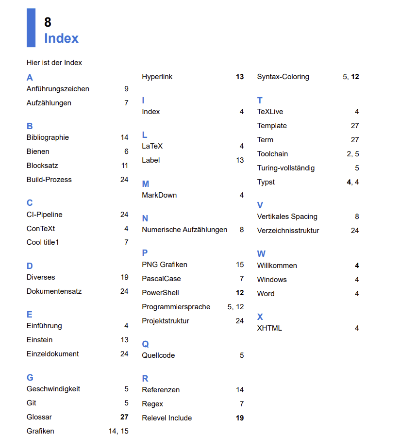

# Typst-index

Automatically create a handcrafted index in [typst](https://typst.app/).
This typst component allows the automatic creation of an Index page with entries
that have been manually marked in the document by its authors. This, in times
of advanced search functionality, seems somewhat outdated, but a handcrafted index
like this allows the authors to point the reader to just the right location in the
document.

⚠️ Typst is in beta and evolving, and this package evolves with it. As a result, no
backward compatibility is guaranteed yet. Also, the package itself is under development
and fine-tuning.

## Importing the Component

To use the index functionality, the component must be available. This
can be achieved by copying the file `index.typ` into the project. It then must be
imported into the file that uses it. The easiest way is to do an

```typ
#import "index.typ": *
```

in the head of the document file(s) that want to use the index.

## Marking Entries

To mark a word to be included in the index, a simple function can be used. In the
following sample code, the word "elit" is marked to be included into the index.

```typ
= Sample Text
Lorem ipsum dolor sit amet, consectetur adipiscing #index[elit], sed do eiusmod tempor
incididunt ut labore et dolore.
```

The marking, by default, is invisible in the resulting text, while the marked word
will still be visible. With the marking in place, the index component knows about
the word, as well as its location in the document.

## Generating the Index Page

The index page can be generated by the following function:

```typ
= Index
#columns(3)[
  #make-index(title: none)
]
```

This sample emits the index in three columns.
Note: The actual appearance depends on your template or other settings of your document.



You may have noticed that some page numbers are displayed as bold. These are index entries which are marked as "main" entries. Such entries are meant to be the most important for the given entry. They can be marked as follows:

```typ
#index(class: classes.main)[Willkommen]
```

Currently, the following classes are supported:

- Simple\
  This is the default class.
- Main\
  This is for important entries. Their pages are printed bold in the index page.
